# IoT Smart Home Network Configuration 🏠📡

A Cisco Packet Tracer simulation of a wireless IoT Smart Home network demonstrating device registration, remote monitoring, and control through a centralized IoT server.

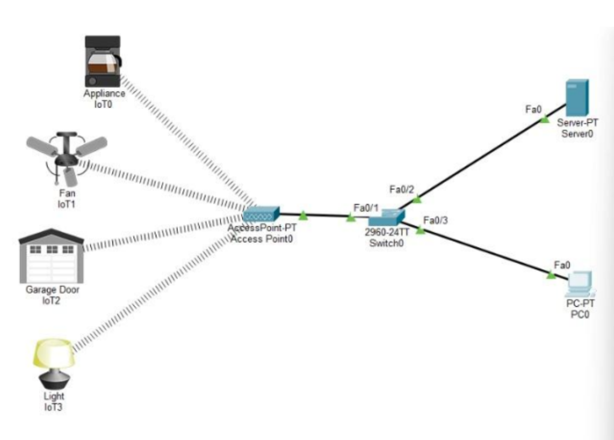

## 📋 Description

This project implements a complete wireless IoT Smart Home network using Cisco Packet Tracer. The system features multiple smart devices (appliance, fan, garage door, and light) connected wirelessly to an access point, registered with a central IoT server, and controllable remotely via a PC monitor or directly through the server interface.

The implementation demonstrates fundamental IoT concepts including wireless connectivity, device registration, centralized server management, and remote monitoring and control capabilities.

## 🎯 Project Objectives

1. **Design Wireless IoT Network**: Create a complete Smart Home network topology
2. **Configure Wireless Access**: Set up secure wireless connectivity with SSID authentication
3. **Implement IoT Server**: Configure centralized device registration and management
4. **Enable Remote Control**: Establish PC-based monitoring and control interface
5. **Verify Wireless Communication**: Ensure all devices operate via wireless connections only

## ✨ Features

### Network Components
- **4 IoT Devices**: Appliance, Fan, Garage Door, Light
- **Wireless Access Point**: Centralized wireless connectivity (SSID: SmartHomeWiFi)
- **IoT Registration Server**: Device management and control hub
- **PC Monitor**: Remote monitoring and control interface
- **Network Switch**: Wired infrastructure (2960-24TT)

### Wireless Configuration
- **SSID Authentication**: Secure wireless network (IoT_Lab)
- **Wireless Device Connectivity**: All IoT devices connect via WiFi
- **Access Point Management**: Centralized wireless access control
- **Signal Verification**: Visual confirmation of wireless links

### IoT Server Capabilities
- **Device Registration**: Centralized registration of all IoT devices
- **User Authentication**: Username/password-based access control
- **Remote Monitoring**: Real-time device status monitoring
- **Direct Control**: On-site control through server interface
- **IPv4 Addressing**: Standard IP-based communication (e.g., 192.168.1.1)

### Control Methods
- **PC Remote Monitor**: Control all devices from PC via IoT Monitor application
- **Server Direct Control**: Local control through server interface
- **Device Operations**: Turn on/off, open/close functionality
- **Manual Testing**: Alt+Click for direct device interaction

## 🔧 Network Topology


**Architecture:**
```
IoT Devices (Wireless)
    ↓
Access Point (SmartHomeWiFi)
    ↓
Switch (2960-24TT)
    ├── IoT Server (192.168.1.1)
    └── PC (IoT Monitor)
```

## 📖 Implementation Guide

### Step 1: Wireless Access Point Configuration

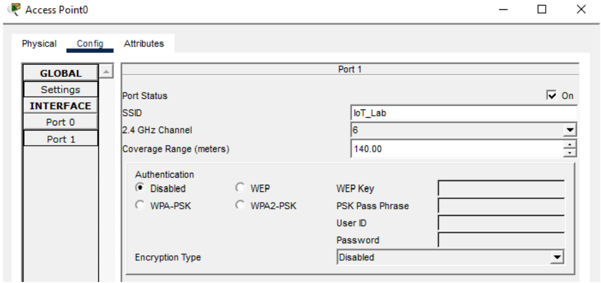

**Configure Access Point:**
- SSID Name: `IoT_Lab` (or `SmartHomeWiFi`)
- Authentication: WPA2 or appropriate security
- Wireless mode: Enable

### Step 2: IoT Device Wireless Connection

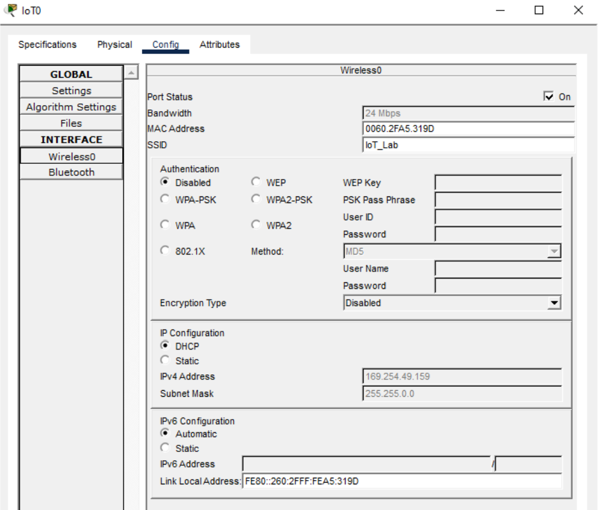

**Connect IoT Devices:**
- Navigate to device wireless settings
- Enter SSID name matching access point (e.g., `IoT_Lab`)
- Verify successful wireless connection
- Confirm wireless link indicator appears

### Step 3: IoT Server Configuration

**Server Setup (Part 1):**

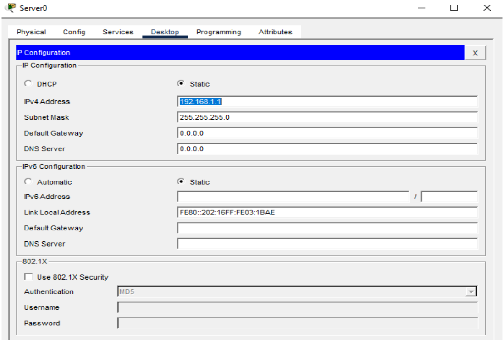

**Server Setup (Part 2):**

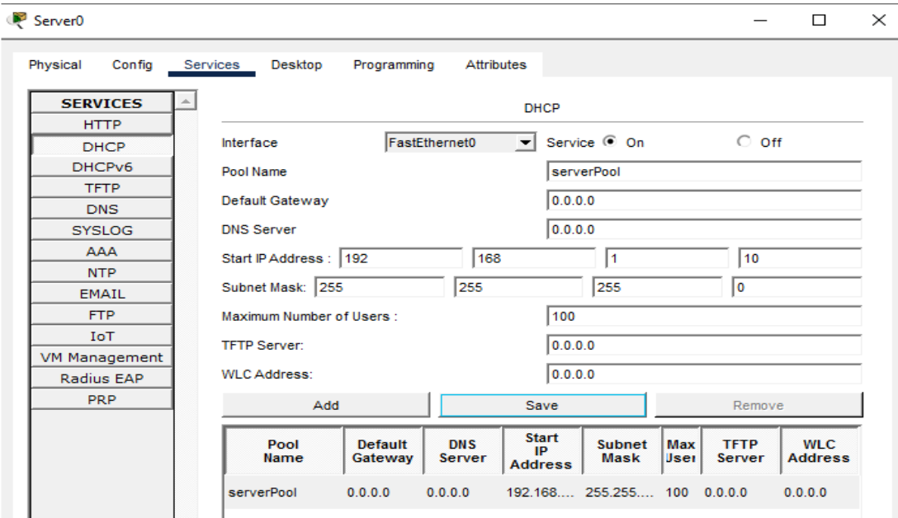

**Configure IoT Server:**
- Set server as IoT Registration Server
- Assign IPv4 address (e.g., 192.168.1.1)
- Create login username and password
- Enable IoT services

### Step 4: Device Registration

**Registration Process:**

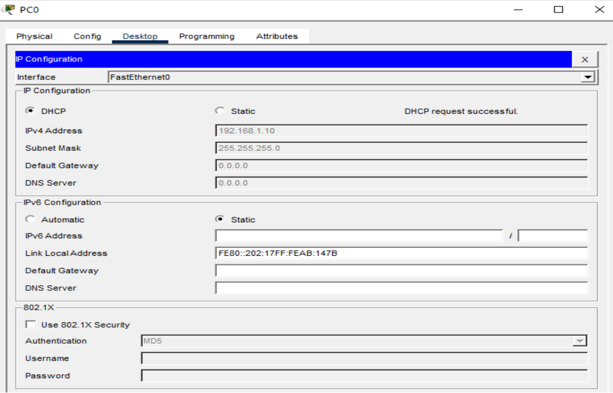

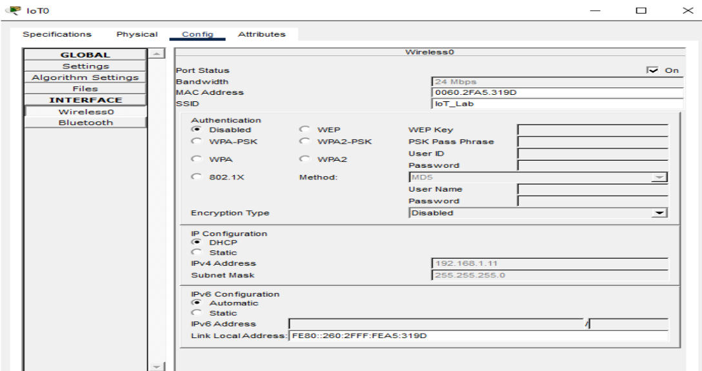

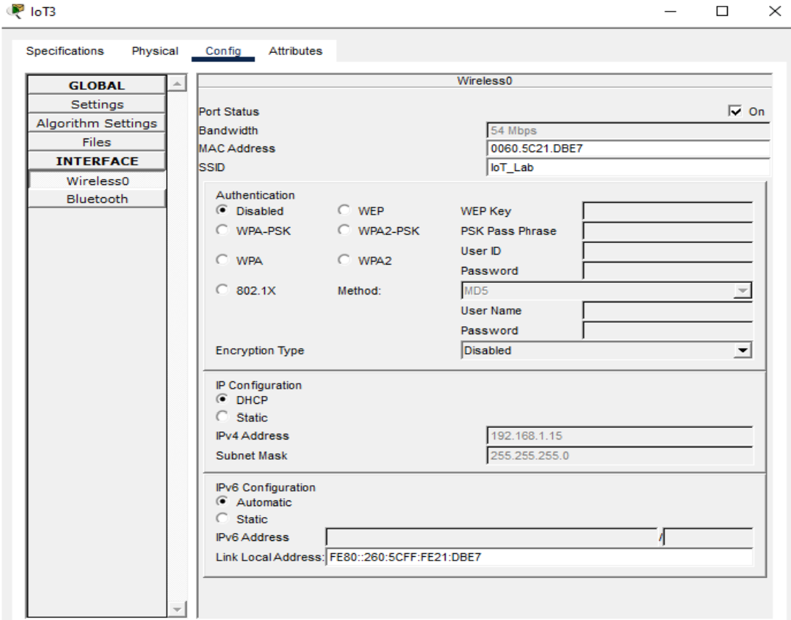

**Register IoT Devices:**
- Access IoT server registration interface
- Add Appliance (IoT0)
- Add Fan (IoT1)
- Add Garage Door (IoT2)
- Add Light (IoT3)
- Verify all devices appear in IoT monitor

### Step 5: Device-to-Server Connection

**Connect Devices to Server:**

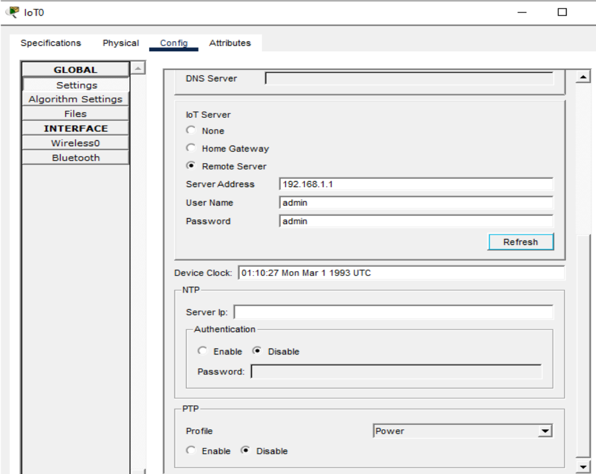

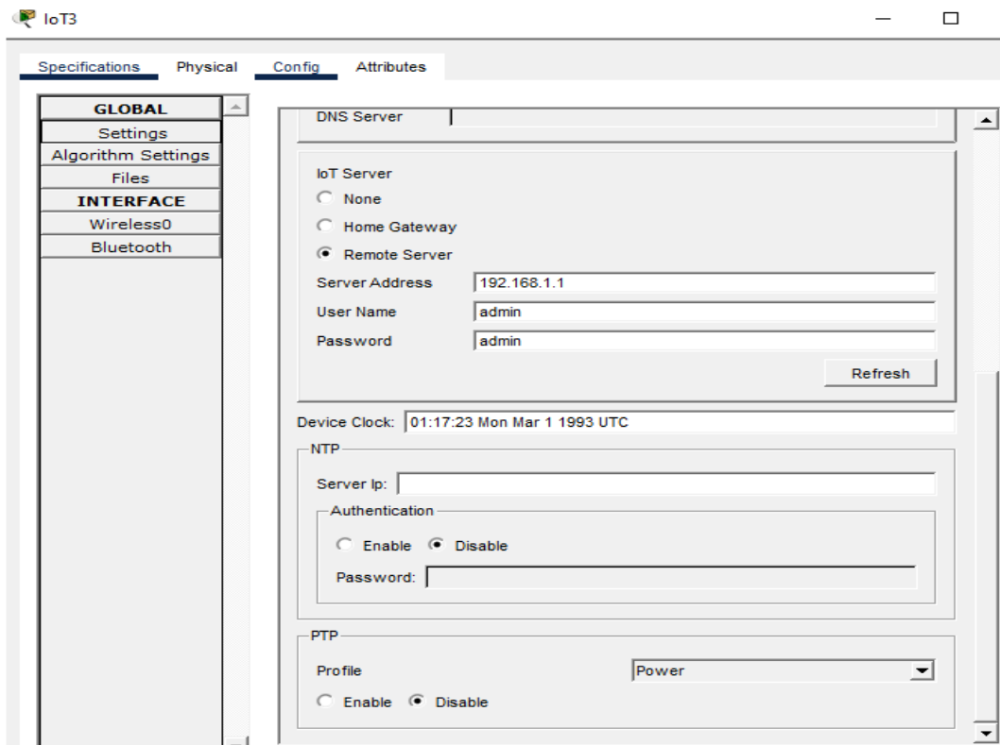

**Configuration:**
- Enter server IPv4 address on each device
- Provide authentication credentials
- Verify successful connection status
- Confirm devices are remotely controllable

### Step 6: Verification and Testing

**Server Monitor Verification:**

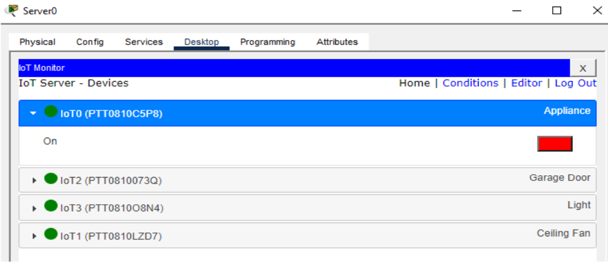

**PC Monitor Verification:**

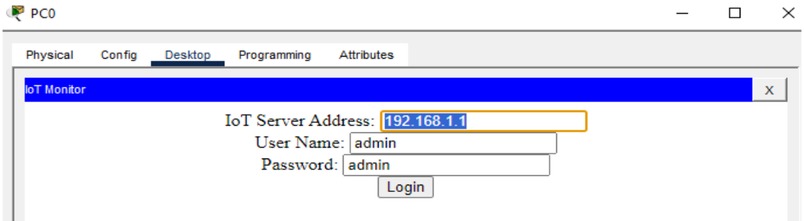

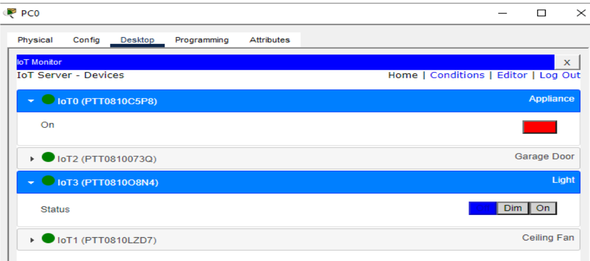

**Testing Methods:**
1. **PC Remote Control**: Open IoT Monitor on PC, login with server credentials
2. **Server Direct Control**: Access IoT interface on Server0
3. **Manual Testing**: Alt+Click on devices for direct interaction
4. **Functionality Test**: Turn devices on/off, open/close garage door
5. **Communication Verification**: Confirm wireless-only operation

## 🚀 Getting Started

### Prerequisites

**Software:**
```
Cisco Packet Tracer 8.0 or later
```

### Setup Instructions

1. **Open Cisco Packet Tracer**
   - Create new project

2. **Add Network Devices**
   ```
   IoT Devices:
   - Appliance (IoT0)
   - Fan (IoT1)
   - Garage Door (IoT2)
   - Light (IoT3)
   
   Network Infrastructure:
   - Access Point (AccessPoint0)
   - Switch 2960-24TT (Switch1)
   - Server (Server0)
   - PC (PC0)
   ```

3. **Physical Connections**
   - Connect Access Point to Switch (copper straight-through)
   - Connect Server to Switch (copper straight-through)
   - Connect PC to Switch (copper straight-through)
   - All IoT devices: Wireless only (no cables)

4. **Wireless Configuration**
   - Configure Access Point with SSID
   - Connect all IoT devices wirelessly to Access Point
   - Verify wireless links established

5. **Server Configuration**
   - Set Server0 as IoT Registration Server
   - Configure IPv4 address
   - Set username/password

6. **Device Registration**
   - Register all IoT devices through server
   - Configure each device with server address
   - Verify connections

7. **PC Monitor Setup**
   - Open IoT Monitor application on PC0
   - Enter server address and credentials
   - Connect to server

8. **Testing**
   - Test device control from PC monitor
   - Test device control from server interface
   - Verify wireless-only communication

## 🎓 Learning Outcomes

This project demonstrates:

1. **IoT Network Design**: Complete wireless smart home architecture
2. **Wireless Networking**: SSID configuration, wireless device connectivity
3. **Server Configuration**: IoT server setup and device registration
4. **Remote Access**: PC-based monitoring and control systems
5. **Network Security**: Authentication and access control
6. **Cisco Packet Tracer**: Network simulation and testing
7. **IoT Protocols**: Device-to-server communication standards

## 🔍 Key Concepts

### SSID Configuration
- **Purpose**: Identify wireless network
- **Security**: WPA2 authentication recommended
- **Consistency**: All devices must use same SSID

### IoT Server Role
- **Registration**: Central device management
- **Authentication**: Secure access control
- **Monitoring**: Real-time device status
- **Control**: Command distribution to devices

### Wireless Communication
- **No Physical Cables**: IoT devices connect wirelessly only
- **Access Point**: Central wireless hub
- **Signal Verification**: Visual link indicators
- **Range Considerations**: Device placement matters

### Control Methods

| Method | Location | Access | Use Case |
|--------|----------|--------|----------|
| PC Monitor | Remote | Via Server IP | Remote management |
| Server Interface | Local | Direct | On-site control |
| Manual Test | Simulation | Alt+Click | Testing/debugging |

## 📝 Configuration Summary

**Access Point:**
- SSID: `IoT_Lab` or `SmartHomeWiFi`
- Security: WPA2 (recommended)
- Mode: Wireless enabled

**IoT Server:**
- IPv4: 192.168.1.1 (example)
- Type: IoT Registration Server
- Authentication: Username/Password required

**PC Monitor:**
- Application: IoT Monitor (Desktop tab)
- Connection: Server IPv4 + credentials
- Functionality: Full device control

## 🤝 Contributing

This is a lab exercise project. Suggestions for enhancements include adding more IoT devices, implementing security features, or creating automation scenarios.

## 📄 License

This project is an educational lab exercise.

## 🙏 Acknowledgments

- CIE 510 - Wireless Sensor Networks and IoT course
- Cisco Packet Tracer platform
- IoT network design fundamentals

## <!-- CONTACT -->
<!-- END CONTACT -->

## **Build and control your wireless IoT Smart Home network! 🏠✨**
